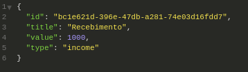
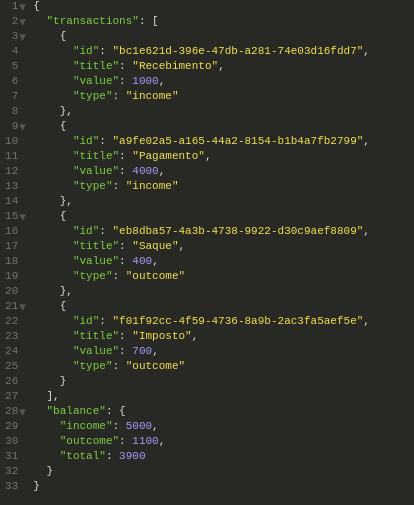
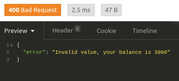
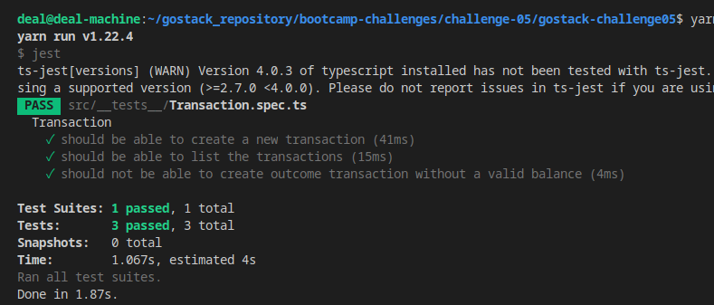

# deal-machine :white_check_mark:

<h2>Bootcamp GoStack Challenge 05 <b>Complete</b> :heavy_check_mark: </h2>

<h3>Rotas da aplicação</h3>
<ul>
  <li><b>POST /transactions</b> A rota recebe 'title', 'value' e 'type', sendo type o tipo da transação, que deve ser income para entradas (depósitos) e outcome para saídas (retiradas). Ao cadastrar uma nova transação, ela deve ser armazenada dentro de um objeto com o seguinte formato: </li>
  
  <li><b>GET /transactions</b> Essa rota retorna uma listagem com todas as transações, junto com o valor de soma de entradas, retiradas e total de crédito. Essa rota retorna um objeto com o formato a seguir:</li>
  
</ul>
 
<h3>Especificação dos testes</h3>
<ul>
  <li><b>should be able to create a new transaction</b> Para que esse teste passe, sua aplicação deve permitir que uma transação seja criada, e retorne um json com a transação criada.</li>
  <li><b>should be able to list the transactions</b> Para que esse teste passe, sua aplicação deve permitir que seja retornado um objeto contendo todas as transações junto ao balanço de income, outcome e total das transações que foram criadas até o momento.</li>
  <li><b>should not be able to create outcome transaction without a valid balance</b> Para que esse teste passe, sua aplicação não deve permitir que uma transação do tipo outcome extrapole o valor total que o usuário tem em caixa, retornando uma resposta com código HTTP 400 e uma mensagem de erro no seguinte formato: { error: string }</li>
  
</ul>
  
  
